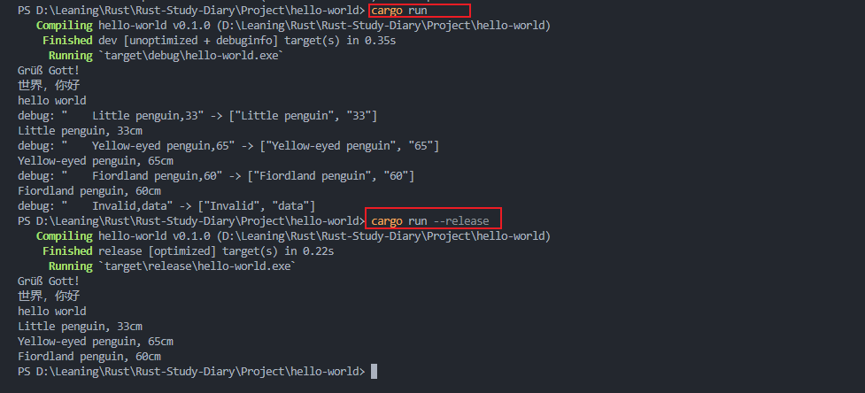
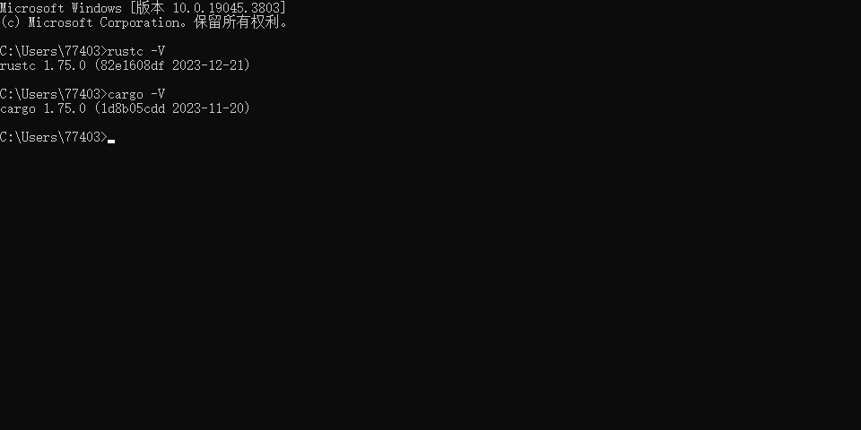

# 学习与思考以及一些碎碎念
在初步了解了Rust语言的应用领域和目前进展之后，决定跟随[Rust](https://course.rs/about-book.html)语言圣经开始系统性的学习Rust这门编程语言。选择学习Rust的原因在书中已经阐明，包括但不限于StakeOverFlow评选的七年最佳语言，linus的推荐等原因。根据书中所说，Rust本身的学习曲线非常陡峭，这一点令我有些犯怵，由于工作强度大，我有些怀疑我是否可以成功入门Rust的领域。

新建一个Rust项目
```Rust
> cargo new world_hello
> cd world_hello
```

在编译和运行Rust项目的时候，由于我用的是windows系统，和圣经出现了细节上的差异，尤其是windows用的是"\"而linux用的是"/"，太久没有用命令行编译过代码了……

debug模式
```
> cargo run
> cargo build
```

debug模式下，编译速度会变快，运行速度会变慢，因为编译器没有做任何的优化，如果需要高性能的代码
release模式  
```
> cargo run --release
> cargo build --release
```

而如果只是想要检查代码是否编译通过，可以使用check命令`cargo check`
题外话：这个功能目前看起来非常实用，我在进行C开发的时候，非常苦恼的就是当项目大了之后，编译速度实在太慢了，导致哪怕我只是想看一下我是否可以编译通过就需要花很多时间。

cargo.toml是一个项目数据描述文件，可以用这个文件来控制项目的构建、测试、运行流程，我理解就是CMake里面的Makefile或者.cmake文件这种作用
cargo.lock是一个项目的依赖详细清单，不太能理解这个概念，我目前的理解是，可运行文件，需要用到这个文件，lib项目，就不需要这个文件
值得注意的是，我观察到在init这个项目的时候，是没有.lock文件的，而我运行了--release版本的构建指令后，出现了这个文件。

在定义项目依赖的时候，cargo提供了三种方式
* 使用Rust官方仓库，通过版本描述来确定
* 使用URL来描述Git仓库
* 使用本地项目的绝对路径或相对路径来描述
```
[dependencies]
rand = "0.3"
hammer = { version = "0.5.0"}
color = { git = "https://github.com/bjz/color-rs" }
geometry = { path = "crates/geometry" }
```

根据教程初步修改运行了hello world的程序后，我注意到，Rust好像是推荐蛇形命名法，如果不使用这种命名方法会报告警。这使工作中使用驼峰命名法的我比较不适应。
Rust的for循环好像都是通过迭代器运行的
prinln后面的!，教程说是一个叫做宏操作符的东西，不知道和C中的宏是否是一个东西

在今天教程的最后，给了一大段程序，小练习是去掉debug信息


笔者没有直接复制，而是手敲了一遍这个代码，照着代码敲也错了不少地方，Rust语言和笔者用过的几种语言都有不少的差异，也有不少的既视感，这段代码的意思大概就是解析了那段string信息。
在手敲了一遍之后，隐约有些意识到了Rust那陡峭的难度曲线到底有多么曲折了……
# 进度总结
初步了解了Rust的背景和目前进度，成功安装了Rust环境

安装了推荐的rust-analyzer等插件
新建了一个Hello-World项目
学习了Rust项目的Build Run Check等功能，学习了.toml .lock等文件的用法。
修改了Hello-World项目，初步熟悉Rust语法。