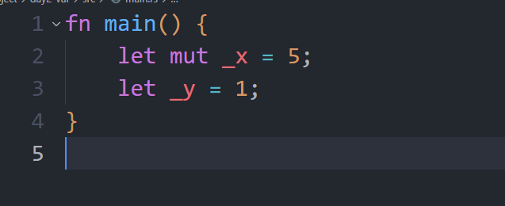

# 学习与反思以及碎碎念
今天主要是替换国内依赖源，主要有两种替换方式。
* 第一种，注册国内镜像源
  这种方式本质上只是多了一个镜像源，在后续使用中，需要在cargo.toml中额外指定使用哪一个镜像源
```
# 注册科大的镜像源
[registries]
ustc = { index = "https://mirrors.ustc.edu.cn/crates.io-index/" }
```
```
# cargo.toml需要额外指定使用哪个镜像源
[dependencies]
time = {  registry = "ustc" }
```
* 第二种，直接替换镜像源
```
# 这种方式修改后，就不再需要修改cargo.toml文件
[source.crates-io]
replace-with = 'ustc'

[source.ustc]
registry = "git://mirrors.ustc.edu.cn/crates.io-index"
```
除此之外，cargo 在1.68版本之后还支持稀疏索引，简单检索后，我对稀疏索引的了解在于，可以不在需要完整的克隆一整个索引仓库，可以进行选择性的克隆，目前对cargo的了解不足，不足以充分了解这个问题。
```
# 稀疏索引格式如下
[source.ustc]
registry = "sparse+https://mirrors.ustc.edu.cn/crates.io-index/"
```

今天正式开始学习rust的语法，开篇先解释了昨天我理解的错误，rust不是推荐蛇形命名法，而是驼峰命名法和蛇形命名法混用，有一个详细的表格记录这一切。
同时，引入了一些很有趣的概念，首先，开篇讲到了只支持声明可变的变量，或只支持声明不可变的变量( 例如函数式语言 )这两个概念我其实有点没能理解，C&C++应该也是可以声明const和普通变量的，没能理解这个位置的区别。
其次，有别于其他语言一个很重要的一面，变量不再是赋值，而是绑定，将一块内存的所有权交给一个变量负责，而不是值传递。那是否意味着Rust没有值传递？变量绑定和指针有什么区别呢。

而变量不可变这一点，也相当奇怪，虽然有mut关键字可以使用，但是我相信语言设计的初衷肯定不是给每个变量加上mut关键字，那么这样的变量不就变成常量了嘛？还是说其实Rust推荐大家使用类似const这样的常量来编程？

用下划线开头告诉编译器不要警告未使用的变量有趣。


变量解构没看明白，目前看起来只是一个比较复杂的变量绑定，是否还有更复杂的变化？

不行了，有点困，今天变量没学完，希望明天可以早点下班。
