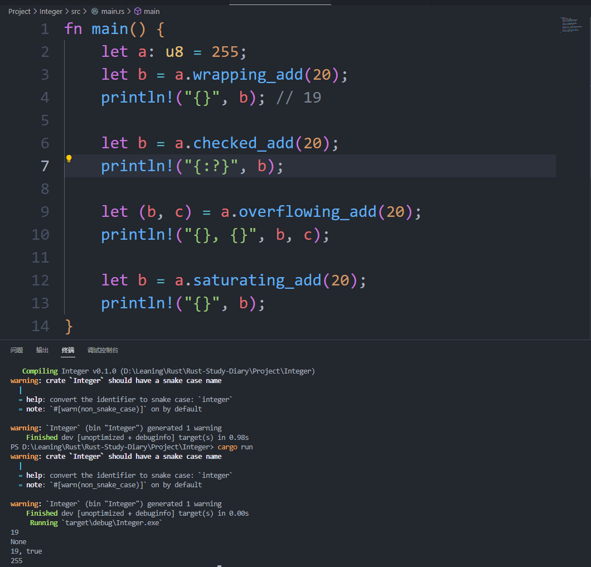

# 学习与反思以及碎碎念
解构式赋值就像是把原先的变量解构给拆分成两步，一步定义变量，一步解构式赋值，主要价值还是在于可以给struct，元组这里特殊类型赋值吧。范例里面用到了“_”这个东西，和golang里面的用法差不多，就是给不想关注的值一个装值的“容器”。
今天教程里面就提到了不可改变的变量和常量的区别，有意思的是，教程里面提到了“常量不仅默认不可变，而且自始至终不可变”，题外话就是变量是可以在let之后，修改为mut的嘛？
同时也提到了常量的两个注意点，一是要加const修饰，二是值的类型必须标注，第二点应当是尤其要注意的。那是否可以推出，变量的类型其实是不确定的？命名也需要注意，Rust 常量的命名约定是全部字母都使用大写，并使用下划线分隔单词，另外对数字字面量可插入下划线以提高可读性。
变量遮蔽就像是更小的作用域会去覆盖更大的作用域一样，如果某个同名变量，作用域更小的优先级更高。用let 使用变量遮蔽来修改变量（或者不能说是修改变量？）会用到两块内存，只是这两块内存绑定的变量刚好同名而已，而用mut修饰的变量修改，是可以只用一块内存，性能更好。

做了课后练习题，验证了一个猜想，用_作为前缀的变量，是不能继续赋值，或输出的。
题目太简单，就不截图了。

进入类型的篇章，整型的定义很直观`有无符号 + 类型大小（位数）`这种形式比long或者longlong这种要直观很多，还有一种类型，isize和usize这两种类型是随着运行的机器的cpu的位数来决定的，如果要开发跨平台的话，是不是要考虑优先用这个？但文中也提到，这两个最好的使用场景是集合的索引。

Rust整型的默认定义是i32，需要记好了，避免未来弄混。

关于整形溢出，有意思的是debug模式，如果整形溢出了，就会panic，release模式则会干脆循环溢出。
而整型溢出也有四种方式，如下图

明天要年终述职了，今天早点睡。
