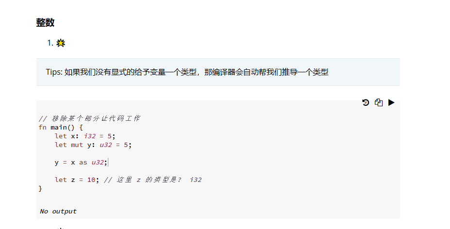
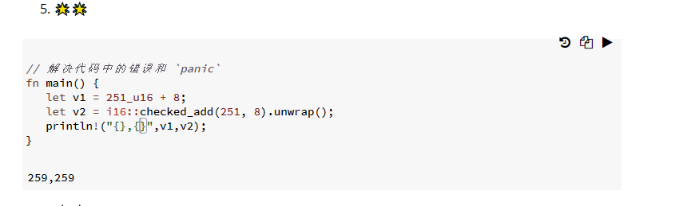
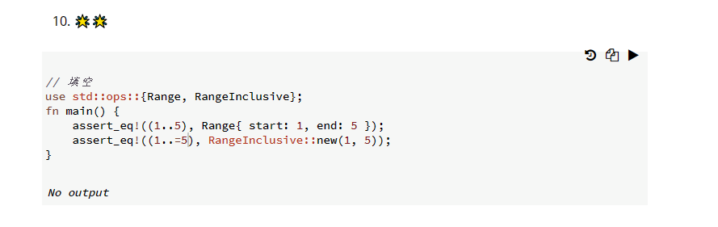
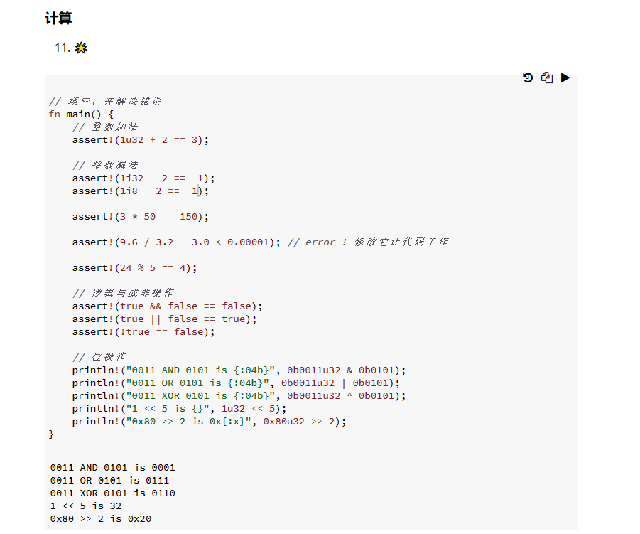

# 学习与反思以及碎碎念
浮点类型默认是f64 IEEE-754
需要注意的是，浮点数实现的是`std::cmp::PartialEq`特征，而不是`std::cmp::Eq`，也就是浮点只能近似相等，当将浮点数作为hashmap的key的时候，就会有问题。
所有和NaN交互的操作都会返回NaN，如果需要防御性编程，就需要使用is_nan()方法来判断。
主动标注类型`let a: i32 = 22;`
还有一种类型后缀的方式进行类型标注`let a = 22i32;`
对于较长的数字可以用_进行分割，提升可读性，这个好！
`let a: = 1_000_000_000;`
打印的时候控制小数位数为两位`println!("{:.2}", a);`
位运算和其他语言没区别，略过
### 序列
1..5就可以生成1到4的序列，1..=5就是生成一到5的序列，也不知道这个序列是以什么形式存在的，元组？
序列只允许用于数值类型和字符类型，类似'a'..='z'这样。同时文章里面也提到，字符和数字值是Rust中仅有的可以用于判断是否为空的类型，没太理解怎么判断？数字值怎么空？NaN嘛？

As可以完成类型转换，但不知道是不修改内存的强转还是会根据字面量进行计算的转换。还有将指针转为地址，地址转为指针的操作，不太理解，我理解中的指针就是地址，为什么还有相互转化的过程呢。

有理数和复数我用到的地方可能不多。略过。

Rust的类型转换必须是显式的，这很重要。
Rust的数值类型可以用方法！这很牛逼，`13.14_f32.round()`，这好离谱。

完成了课后作业，值得记录的题目如下。

