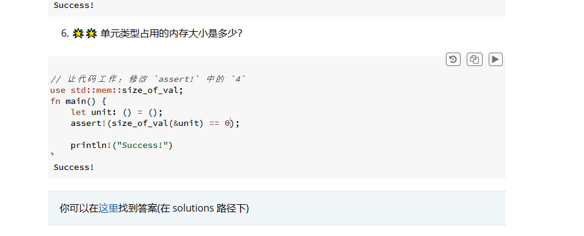
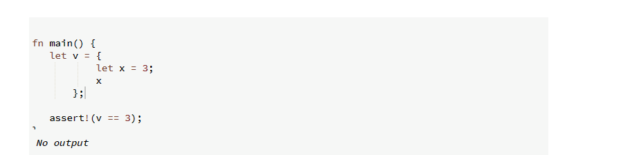

# 学习与反思以及碎碎念
Rust里面的字符类型不是ASCII码，而是Unicode编码，所以默认的字符类型是4个字节，32位的。Rust的单个字符是用''来表示，字符串是用""来表示的。
布尔值占用一个字节。
还有一个叫单位类型的，给我干蒙了。就是()，单位类型唯一的值也是()。比如fn main()返回的就是()单位类型。不能说main没有返回值，因为Rust里面的无返回值有一个特定的名称叫diverge function（发散函数）。此外()也可以作为map的值，表示我们不关注具体的值，只关注key。这种用法和golang的struct{}用法类似，只占位，不占用内存。虽然我已经完全忘了golang的struct{}是啥用法了。

值得保存的课后习题：


Rust的函数是由语句和表达式构成的，具体分类如下：
```
fn add_with_extra(x: i32, y: i32) -> i32 {
    let x = x + 1; // 语句
    let y = y + 5; // 语句
    x + y // 表达式
}
```
没有专门的return这样的东西，表达式就是这个函数的返回值。这个特点和很多编程语言还是有很大的不同的。
完成了一个具体的操作，但没有返回值的被称为语句，例如：
```
let a = 8;
let b: Vec<f64> = Vec::new();
let (a, c) = ("hi", false);
```
这些都是语句。

函数，宏，用花括号包裹这类，都是表达式，只要有返回值，都可以被认为是表达式。
表达式不能包括分号！这一点很重要，如果加上分号，就变成语句了。
如果表达式不返回任何值，会隐式的返回一个单位类型。
有意思的是，if语句块也是一个表达式，可以玩点花的，比如：
```
fn main() {
    assert_eq!(ret_unit_type(), ())
}

fn ret_unit_type() {
    let x = 1;
    // if 语句块也是一个表达式，因此可以用于赋值，也可以直接返回
    // 类似三元运算符，在Rust里我们可以这样写
    let y = if x % 2 == 1 {
        "odd"
    } else {
        "even"
    };
    // 或者写成一行
    let z = if x % 2 == 1 { "odd" } else { "even" };
}
```

值得记录的题目：
