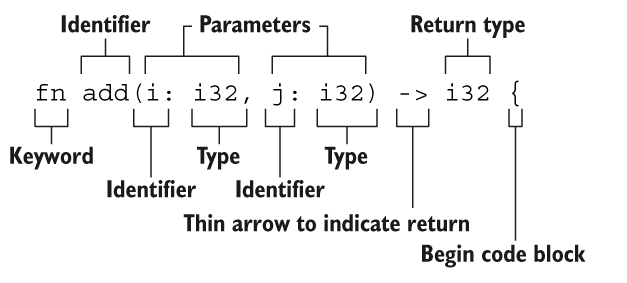
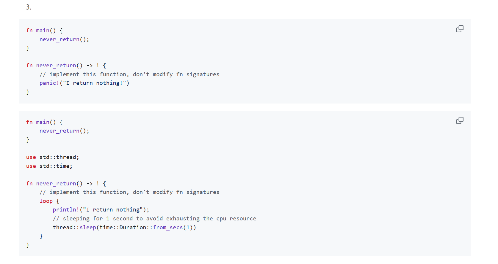
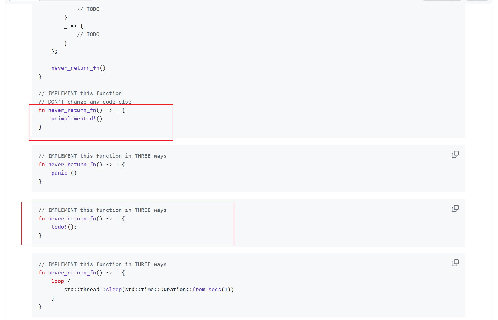
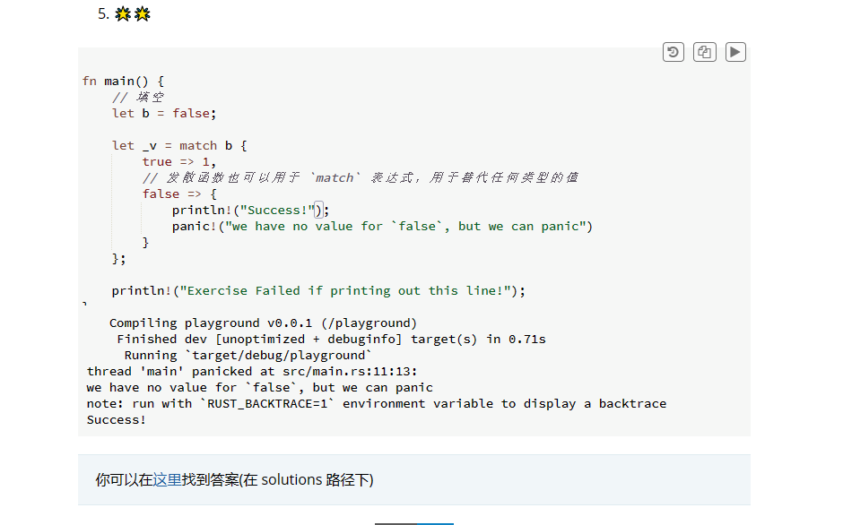

# 学习与反思以及碎碎念

这个结构基本还是可以看明白的。
函数和变量名都建议用蛇形命名法，同时Rust不关注我们把函数定义在哪里，只要有定义就可以了。每个函数的参数都需要标注类型。
之前提过可以用表达式来返回函数的返回值，实际上可以用return提前返回表达式的值，也就是最后一条可以不用return。
其中非常特殊的是，有一种没有返回值的函数，叫发散函数，形式如下：
```
fn dead_end() -> ! {
  panic!("你已经到了穷途末路，崩溃吧！");
}
```
这种函数一般用于抛出异常（没太明白和返回()有啥区别）。
发散函数的两种用法

写不来的题目

其中，unimplemented和todo有特殊的含义:
unimplement!()：未实现（not implemented）
todo!()：尚未被实现（not yet implemented）
两个宏函数都可以导致panic，但是这两个方法的语义不同。

也就和c里面的switch的default一样的感觉吧，也不太像。这个发散函数好抽象，不太能理解。感觉发散函数像是那种进去了就不准备出来了，要么panic，要么就无限循环了。