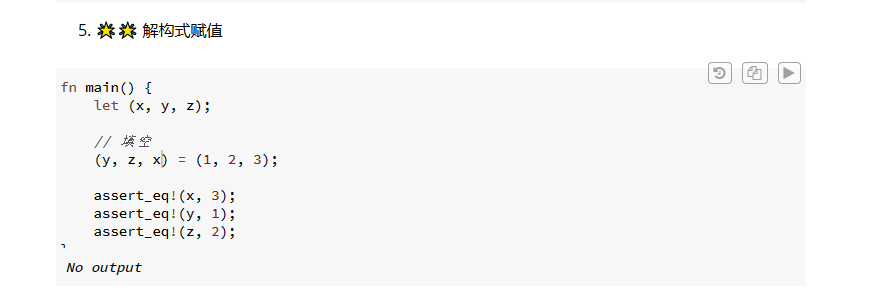
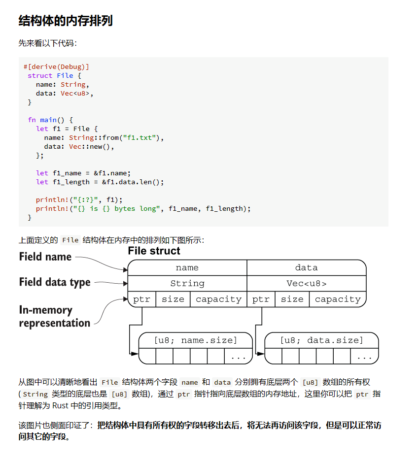
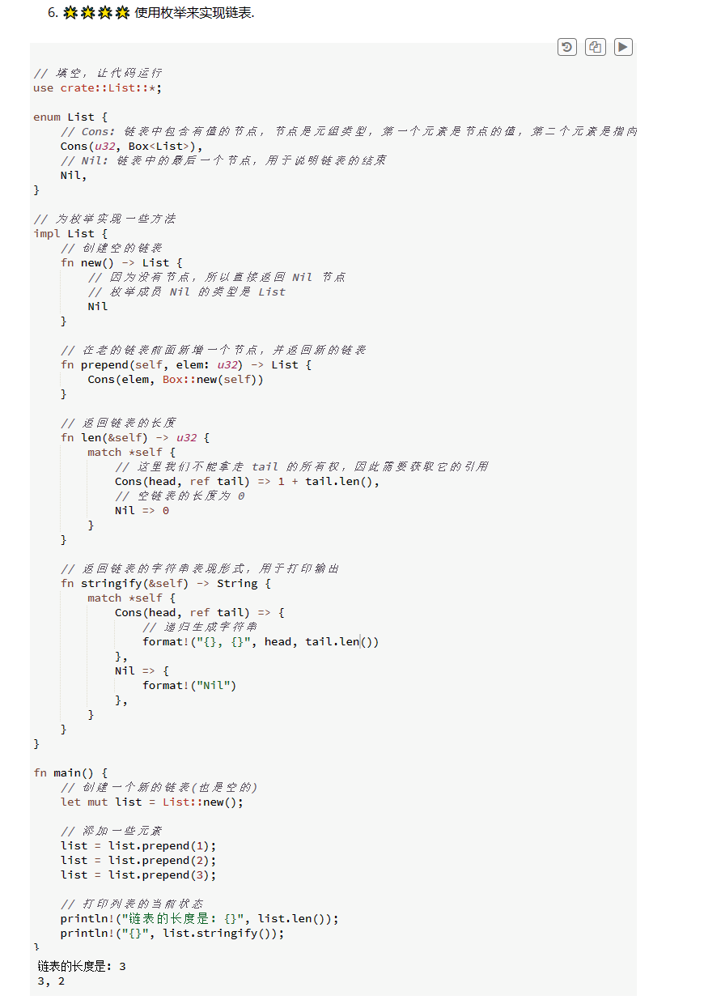

# 学习与反思以及碎碎念
元组看起来有点简单，主要用法也就是构造元组和用模式匹配解构元组而已。
元组的成员不限于三个，可以是多个的。

结构体的定义方式
```
struct User {
    active: bool,       // 逗号分隔
    username: String,
    email: String,
    sign_in_count: u64,
}
```
而实例化结构体时，需要注意：
* 初始化实例时，每个字段都必须要初始化。
* 初始化时，字段初始化顺序可以不一致。
* 如果要修改结构体里面的字段的值的话，就需要将整个结构体声明为可变的，无法只声明一个字段是否可变。
简化结构体创建：
```
fn build_user(email: String, username: String) -> User {
    User {
        email,
        username,
        active: true,
        sign_in_count: 1,
    }
}
```
如果要用一个已有的结构体去实例化一个新的，可以只更新部分字段。
```
let user2 = User {
    email: String::from("another@example.com"),
    ..user1
};
```
..user1必须在结构体的尾部使用。结构体之间的“=”号，也是所有权转移，当所有权转移后，这个结构体的实例就不能用了，但里面的字段还能用，比如有一些int，bool这类的字段。

单元结构体：没有字段和属性
如果只想关注结构体的行为，而不是内容，可以使用单元结构体。
如果想要在结构体里面使用引用，就必须加上生命周期标识符。
如果不想实现display，也不想实现debug，就可以加上`#[derive(Debug)]`，加上后，就可以之间print了
用dbg宏可以更方便的调试，可以包括文件名，文件行号等内容。

Rust里面的枚举和C差别很大，这里的枚举不再是一种特殊的整形，因为里面的枚举成员是可以包括任何类型的值的，从用法的角度来看，更像是C里面的驱动表写法？枚举本质上是一个名字。
Option枚举用于处理空值。但我没看明白这个Option<T>有啥用
