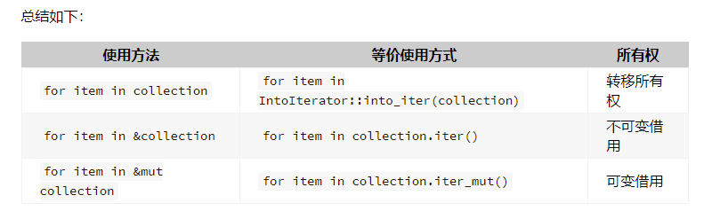
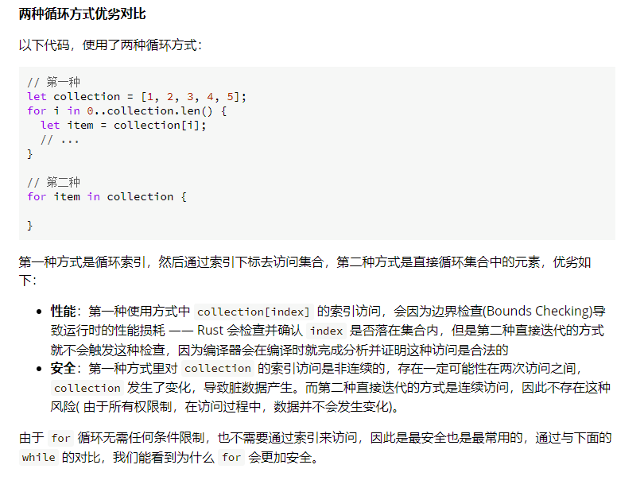

# 学习与反思以及碎碎念
数组三要素：
* 长度固定
* 元素必须有相同的类型
* 依次线性排列
静态数组：Array
动态数组：Vector
分为动态长度和静态长度这一点和C很像
array是存储在栈上的，性能优秀
使用以下语法初始化一个固定值的数组：
```
let arr = [3; 5];
```
这个语句的意思是定义一个长度为5的数组，全部填充3。不过这种方法只能使用于实现了Copy方法的类型，也就是基本类型。
切片是运行期的数据结构，数组是编译期的数据结构。

流程控制：
if语句块返回的是表达式，如果要用if来赋值，就需要保证各分支返回值一致。
for循环的格式是`fot 元素 in 集合`这样的形式。需要注意的是，如果传入的集合不是引用，就会把所有权给move出去。

可以用_来代替变量来for循环。
for循环也有两种方法，一种方式是索引访问，一种是迭代器访问，具体区别如下：

性能方面我能理解。安全方面的话，我感觉像是如果用第二种方式，就相当于for循环把所有权给拿住了，不允许其他线程来访问这块内存了。
while就不提了，没啥区别
loop循环相当于一个内置无限循环，需要和break搭配起来用。需要注意的是，loop相当于一个表达式，break后是可以跟一个表达式作为返回的。