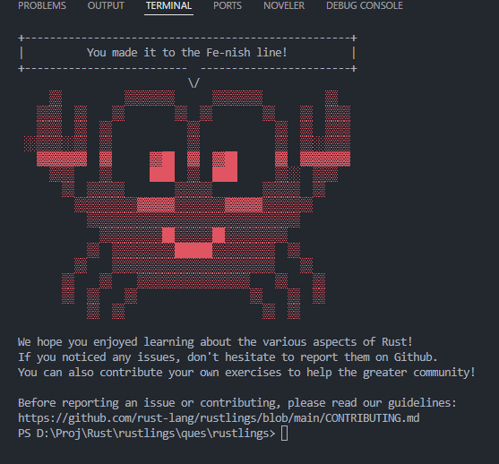

# 学习与反思以及碎碎念
## 知识点1：Thread
Rust的线程模型是**1:1**的，因为需要保持尽可能小的运行时（**无GC、不带绿色调度器、不带协程栈等**）
子线程虽然可能是父线程创建的，但它显然不依赖于父线程，实际上如果父线程结束，其子线程也不一定会结束。
子线程结束只有两种情况：
* 子线程的代码运行完成。
* main主进程结束。
## 知识点2：Send和Sync特征
这两个特征虽然是保证多线程并发安全的关键特征，但实际上这两个特征只是**标记特征**，并不实现任何具体的接口。实际上Rust**不推荐**使用者自己实现Send和Sync特征，如果必须，那么就只能用unsafe（**因为Send和Sync是unsafe特征**）小心的维护线程安全性。
## 知识点3：枚举的内存占用
虽然不同的类型可以用一个枚举类型概括起来，如：
```Rust
enum Fruit {
    Apple(u8),
    Orange(String)
}
```
但实际上Rust会按照枚举中最大的成员进行内存对齐，在上文的例子中，也就是String类型。
## 知识点4：通道
通道的结束方式有两种
* 所有发送者被drop
* 所有接收者被drop
# 完成Rustlings了！

完成Rustlings算是我在rust学习道路上面踏出的一小步吧，通过rustlings初步的完成了Rust一些基本内容的学习，在边学边练的过程中，逐渐体会到了Rust，乃至现代编程语言在设计角度的一些探索和思考，这些体会对于原先使用C&CPP的我是难能可贵的。正因为我在使用C&CPP中，体会到了一些困难和痛苦，才逐渐意识到，Rust某些设计的由来。下一步我应该会去找一些Rust相关的开源项目进行拆解和通读，争取提一些PR到开源项目中。